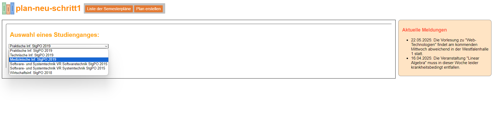
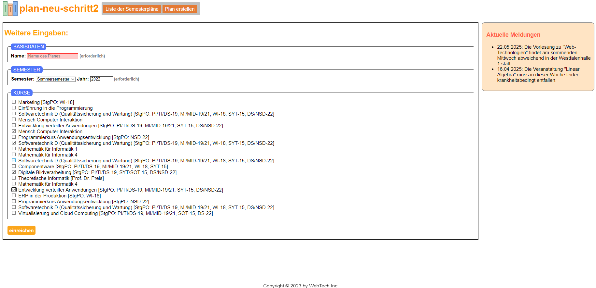
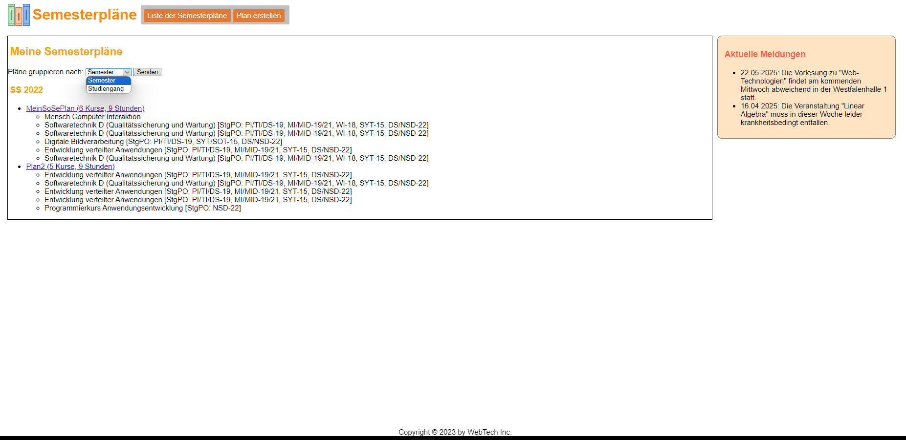
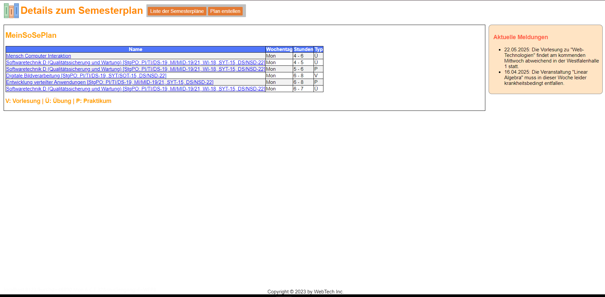
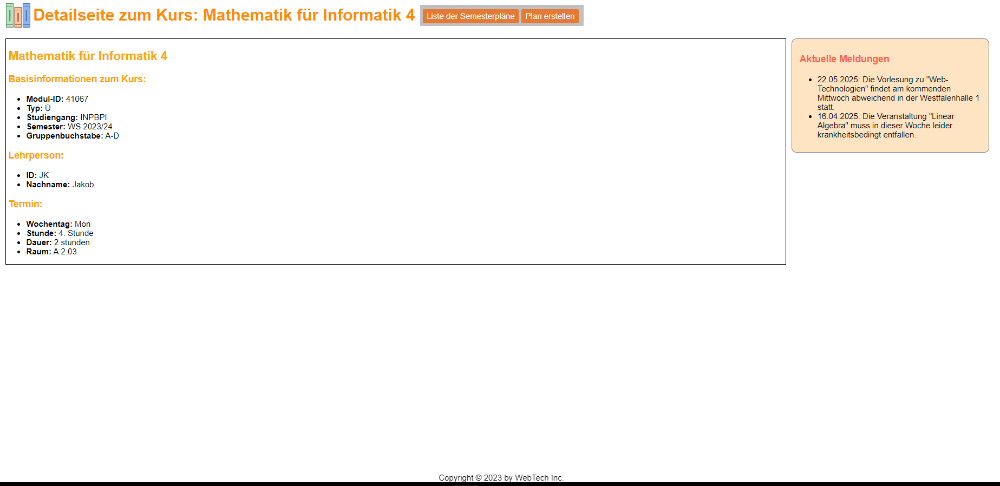
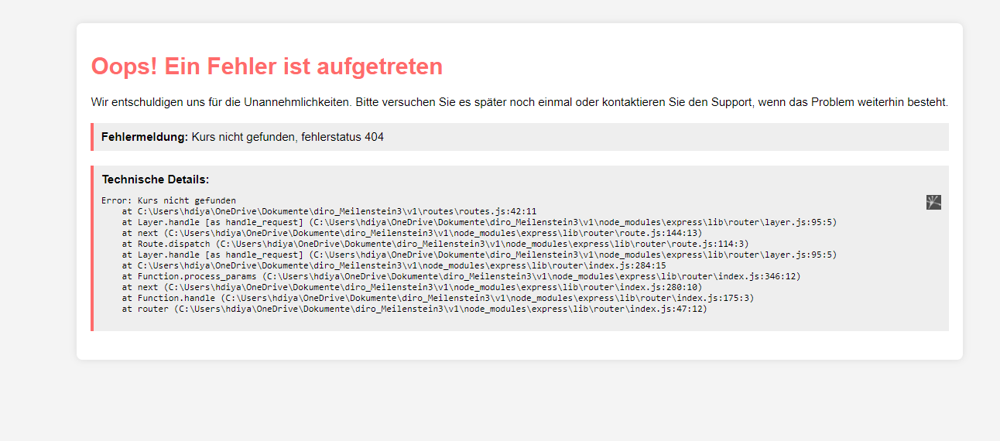
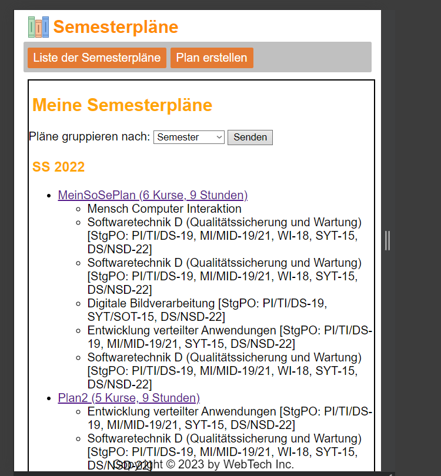
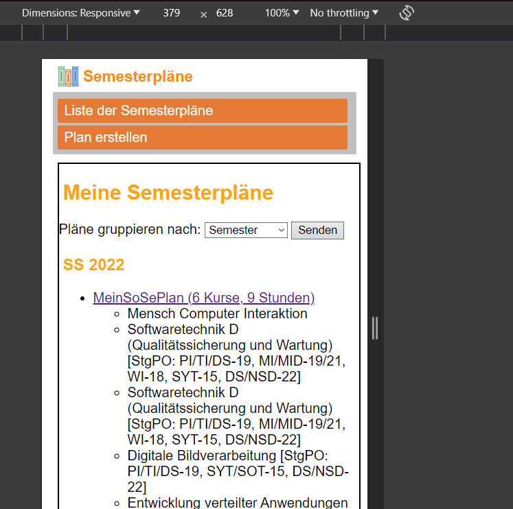

# Stundenplan für FH Dortmund

Entwickelt für Studienzwecke, nutzt diese Webseite moderne Webtechnologien wie Node.js, HTML, CSS, JavaScript, Express.js, sowie Template-Engines wie EJS. Sie ermöglicht Studierenden der FH Dortmund, ihren Stundenplan interaktiv und benutzerfreundlich zu gestalten. Durch die Verwendung dieser Technologien bietet die Anwendung eine nahtlose Integration von Funktionalität und Design, um den akademischen Alltag effizient zu organisieren.

## Screenshots

### Plan erstellen

Auf dieser Seite können Benutzer einen neuen Stundenplan erstellen.

### Plan erstellen Schritt 2

Eine Fortsetzung des Prozesses zum Erstellen eines Stundenplans mit zusätzlichen Optionen.

### Liste der Semesterpläne

Übersicht aller verfügbaren Semesterpläne zur Auswahl.

### Details zum Semesterplan

Diese Ansicht zeigt die Details eines ausgewählten Semesterplans, einschließlich aller Kurse und geplanten Zeiten.

### Details zu Kursen

Hier wird die Detailansicht eines Kurses gezeigt, inklusive Informationen zum Zeitplan, Dozenten und Raumnummer.

### Fehlerseite

Ein Beispiel für eine Fehlerseite, die Nutzer sehen, wenn ein Problem auftritt.

### Responsive Design

Beispiele für das responsive Design der Anwendung, die sicherstellen, dass die Seite auf verschiedenen Geräten gut aussieht und funktioniert.

## Wie man das Projekt startet

Um das Projekt zu starten, müssen folgende Schritte durchgeführt werden:

1. Klone das Repository.
2. Installiere alle Abhängigkeiten mit `npm install`.
3. Starte den Server mit `npm start`.
4. Öffne `localhost:3000` im Browser.

Stelle sicher, dass Node.js und npm auf deinem Computer installiert sind, bevor du diese Schritte ausführst.
